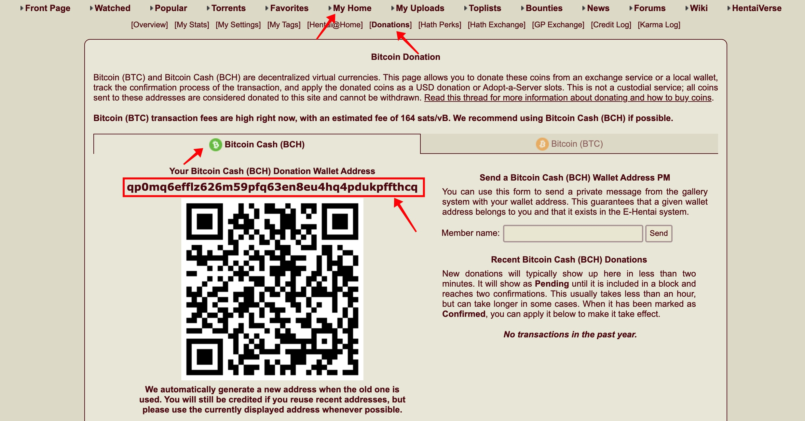

# Ehentai-Donation
A tutorial about how to donate Ehentai.org 

ehentai : https://e-hentai.org/  

exhentai : https://exhentai.org/  

exhentai has more content(like lolicon, guro etc...)

Click on the exhentai address. If any content appears, it means that your account has permission to access exhentai,
if you can't, you can choose to donate, after you donate, you can see the Exhentai's content in Ehentai(You will see more content in Ehentai)

If you have any question, you can ask in my tg group
https://t.me/carbon_research

# 2. Get the donation address of your ehentai account.

log in to your account, My Home → Donation → Bitcoin Cash 

You can see a string of letters on the left

qp0mq6efflz626m59pfq63en8eu4hq4pdukpffthcq

This is our bch wallet address, which we will use later

# 3. How to buy crypto currency

**Personal recommendation [Binance](https://accounts.binance.com/zh-CN/register?ref=R1SE0A44), the world’s largest digital currency exchange**

1. [Binance](https://accounts.binance.com/zh-CN/register?ref=R1SE0A44) (0.1% trading fee, friendly operation interface, reference code [R1SE0A44](https://accounts.binance.com/zh-CN/register?ref=R1SE0A44](https://accounts.binance.com/zh-CN/register?ref=R1SE0A44))

First, register an account on Binance and use my refereal link to get the highest level of fee rebate

(Do not use IP addresses from the United States, Japan, or Hong Kong, Binance does not provide services in these places)

After completing the verification, please send a private message on telegram @carbon_x

Receive exclusive benefits of 5/12usdt

referal link

[https://www.binance.com/zh-CN/join?ref=R1SE0A44](https://www.binance.com/zh-CN/join?ref=R1SE0A44)

All crypto currency transactions are conducted using the U.S.dollar stable coin USDT

 (1:1 with the U.S. dollar, **1USDT is equivalent to 1 U.S. dollar**)

Register an account and complete identity verification, then you can purchase USDT

## Web version tutorial

on the left corner, please select Buy Crypto

In the next page, please select you local currency usdt and the select the payment method, and then follow the website.

After finish the purchase, you will get your USDT in your funding wallet

Enter funding wallet, then click transfer

transfer from funding account to fair and spot account, enter the quantity, and then click Confirm

choose trade, spot

Select the search box at the top of the home page, enter bch, and select the bch/usdt trading pair

